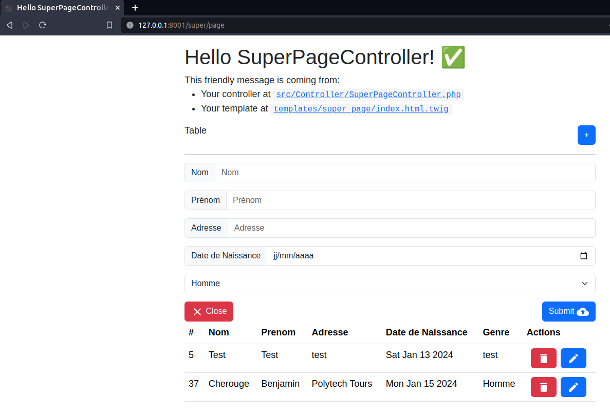

<div align="center" id="top"> 
  

  &#xa0;

  <!-- <a href="https://projet_tp.netlify.app">Demo</a> -->
</div>

<h1 align="center">Projet_tp</h1>

<p align="center">
  

  

  

  

  <!--  -->

  <!--  -->

  <!--  -->
</p>

<!-- Status -->

<!-- <h4 align="center"> 
	🚧  Projet_tp 🚀 En construction...  🚧
</h4> 

<hr> -->

<p align="center">
  <a href="#dart-about">About</a> &#xa0; | &#xa0; 
  <a href="#sparkles-features">Features</a> &#xa0; | &#xa0;
  <a href="#rocket-technologies">Technologies</a> &#xa0; | &#xa0;
  <a href="#white_check_mark-requirements">Requirements</a> &#xa0; | &#xa0;
  <a href="#checkered_flag-starting">Starting</a> &#xa0; | &#xa0;
  <a href="#memo-license">License</a> &#xa0; | &#xa0;
  <a href="https://github.com/{{Inserer-Pseudo}}" target="_blank">Author</a>
</p>

<br>

## :dart: About ##

Ce projet vise à créer un site permettant de recenser les habitants d'une commune. Le site permettra de collecter les informations suivantes pour chaque habitant :

- Nom
- Prénom
- Date de naissance
- Genre
- Adresse

L'interface en ligne permet de créer, modifier et supprimer des habitants. Elle permet également de rechercher des habitants par nom, prénom, date de naissance, genre ou adresse.

## :sparkles: Implémentation ##

:heavy_check_mark: Créer, modifier et supprimer un habitant;\
:heavy_check_mark: Afficher la liste des habitants et leur infos;\
:x: Effectuer un tri dans la liste;
:x: Rechercher un habitant par nom, prénom, date de naissance, genre ou adresse;

## :rocket: Technologies ##

Les outils suivants ont été utilisés dans ce projet :

- Framework web : [Symfony](https://https://symfony.com//)
- Serveur base de données : [mySQL_server](https://www.mysql.com/fr/)
- Base de données : [MariaDB](https://mariadb.org/)
- ORM : [Doctrine](https://www.doctrine-project.org/)
- Frontend : [React](https://reactjs.org/)

## :white_check_mark: Prérequis ##

Avant de commencer :checkered_flag:, vous devez avoir [Git](https://git-scm.com) installé.

## :checkered_flag: Démarrage ##

```bash
# Clonez ce projet
$ git clone https://github.com/Inserer-Pseudo/projet_tp

# Accédez au répertoire
$ cd projet_tp

# Démarrer le serveur mySQL
$ sudo /opt/lampp/xampp start

# Lancez le backend
$ symfony server:start

# Lancez le frontend
$ rien à faire, il est build (npm run build)

# Lancez le frontend (en mode dev-server)
$ npm run dev-server

# Le serveur s'initialisera à l'adresse <http://127.0.0.1:8001/super/page>
Ne pas utiliser localhost à cause des CORS (pas résolu)
```

Made with :heart: by <a href="https://github.com/Inserer-Pseudo" target="_blank">Benjamin</a>

&#xa0;

<a href="#top">Back to top</a>
